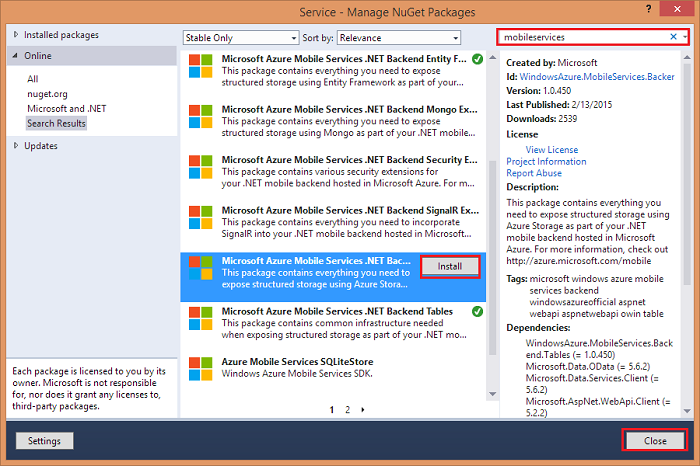

<properties 
	pageTitle="构建使用表存储的 .NET 后端移动服务 | Azure 移动服务" 
	description="了解如何对 .NET 后端移动服务使用 Azure 表存储。" 
	services="mobile-services" 
	documentationCenter="" 
	authors="ggailey777" 
	manager="dwrede" 
	editor=""/>

<tags 
	ms.service="mobile-services" 
	ms.date="12/11/2015"
	wacn.date="01/29/2016"/>

# 构建使用表存储的 .NET 后端移动服务

[AZURE.INCLUDE [mobile-service-note-mobile-apps](../includes/mobile-services-note-mobile-apps.md)]

&nbsp;

本主题说明如何将非关系数据存储用于 .NET 后端移动服务。在本教程中，你将要修改移动服务快速入门项目，以使用 Azure 表存储而不是默认的 SQL 数据库数据存储。

在学习本教程之前，需要先完成[移动服务入门]教程。你还需要一个 Azure 存储帐户。

##在 .NET 后端移动服务中配置 Azure 表存储

首先，需要配置移动服务和 .NET 后端代码项目以连接到 Azure 存储空间。

1. 在 Visual Studio 中的“解决方案资源管理器”内，右键单击 .NET 后端项目，然后选择“管理 NuGet 包”。

2. 在左窗格中，依次选择“联机”类别、“仅限稳定版本”，搜索 **MobileServices**，单击“Azure 移动服务 .NET 后端 Azure 存储空间扩展”包对应的“安装”，然后接受许可协议。

    

  	这会将 Azure 存储空间服务支持添加到 .NET 后端移动服务项目。

3. 如果你尚未创建你的存储帐户，请参阅[如何创建存储帐户](/documentation/articles/storage-create-storage-account)。

4. 在 [Azure 经典门户]中，单击“存储”，单击存储帐户，然后单击“管理密钥”。

5. 记下“存储帐户名称”和“访问密钥”。
 
6. 在移动服务中，单击“配置”选项卡，向下滚动到“连接字符串”并输入新的连接字符串（其“名称”为 `StorageConnectionString`，其“值”为存储帐户连接字符串且格式如下）。

		DefaultEndpointsProtocol=https;AccountName=<ACCOUNT_NAME>;AccountKey=<ACCESS_KEY>;

	

7. 在上述字符串中，使用门户中的值替换 `<ACCOUNT_NAME>` 和 `<ACCESS_KEY>` 的值，然后单击“保存”。

	存储帐户连接字符串将以加密形式存储在应用设置中。你可以在运行时在任何表控制器中访问此字符串。

8. 在 Visual Studio 的解决方案资源管理器中，打开移动服务项目的 Web.config 文件，并添加以下新连接字符串：

		<add name="StorageConnectionString" connectionString="<STORAGE_CONNECTION_STRING>" />

9. 将 `<STORAGE_CONNECTION_STRING>` 占位符替换为步骤 6 中的连接字符串。

	移动服务在本地计算机上运行时将使用此连接字符串，使你可以在发布之前测试代码。在 Azure 中运行时，移动服务将改用门户中设置的连接字符串值，并忽略项目中的连接字符串。

## 修改数据类型和表控制器

由于 TodoList 快速入门项目设计用于处理使用 Entity Framework 的 SQL 数据库，因此你需要在项目中进行一些更新才能使用表存储。

1. 将 **TodoItem** 数据类型修改为派生自 **StorageData** 而不是 **EntityData**，如下所示。

	    public class TodoItem : StorageData
	    {
	        public string Text { get; set; }
	        public bool Complete { get; set; }
	    }

	>[AZURE.NOTE]**StorageData** 类型的 Id 属性需要一个复合键，该键是格式为 *partitionId*,*rowValue* 的字符串。

2. 在 **TodoItemController** 中添加以下 using 语句。

		using System.Web.Http.OData.Query;
		using System.Collections.Generic;

3. 将 **TodoItemController** 的 **Initialize** 方法替换为以下内容。

        protected override void Initialize(HttpControllerContext controllerContext)
        {
            base.Initialize(controllerContext);

            // Create a new Azure Storage domain manager using the stored 
            // connection string and the name of the table exposed by the controller.
            string connectionStringName = "StorageConnectionString";
            var tableName = controllerContext.ControllerDescriptor.ControllerName.ToLowerInvariant();
            DomainManager = new StorageDomainManager<TodoItem>(connectionStringName, 
                tableName, Request, Services);          
        }

	这将使用存储帐户连接字符串为请求的控制站创建新的存储域管理器。

3. 将现有的 **GetAllTodoItems** 方法替换为以下代码。

		public Task<IEnumerable<TodoItem>> GetAllTodoItems(ODataQueryOptions options)
        {
            // Call QueryAsync, passing the supplied query options.
            return DomainManager.QueryAsync(options);
        } 

	不同于 SQL 数据库，此版本不返回 IQueryable<TEntity>，因此可以绑定到结果，但无法在查询中进一步编写。

## 更新客户端应用

需要在客户端上进行一项更改，使快速入门应用能够处理使用表存储的 .NET 后端。这是因为表存储提供程序需要复合键。

1. 打开包含数据访问代码的客户端代码文件，并查找执行插入操作的方法。

2. 更新正在添加的 TodoItem 实例，以显式设置采用字符串格式 `<partitionID>,<rowValue>` 的 Id 字段。

	这是一个说明如何在 C# 应用中设置此 ID 的示例，其中 partition 部分是固定的，row 部分基于 GUID 。

		 todoItem.Id = string.Format("partition,{0}", Guid.NewGuid());

现在，可以测试应用。

## 测试应用程序

1. （可选）重新发布移动服务 .NET 后端项目。 
	
	你也可以先在本地测试移动服务，然后将 .NET 后端项目发布到 Azure。无论是在本地还是在 Azure 中测试，移动服务都使用 Azure 表存储。

2. 运行已连接到移动服务的快速入门客户端应用。

	请注意，你看不见以前使用快速入门教程添加的项。这是因为表存储目前是空的。

3. 添加新项以生成数据库更改。
 
	应用和移动服务的行为应如同以往，不过，数据现在将存储在非关系存储而不是 SQL 数据库中。

##后续步骤

现在你已知道，为 .NET 后端使用表存储是如此简单，接下来建议你了解其他一些后端存储选项：

+ [使用混合连接来连接到本地 SQL Server](/documentation/articles/mobile-services-dotnet-backend-hybrid-connections-get-started) 混合连接可让移动服务安全地连接到本地资产。这样，移动客户端便可以使用 Azure 访问你的本地数据。支持的资产包括静态 TCP 端口上运行的任何资源，例如 Microsoft SQL Server、MySQL、HTTP Web API 和大多数自定义 Web 服务。

+ [使用移动服务将图像上载到 Azure 存储空间](/documentation/articles/mobile-services-dotnet-backend-windows-store-dotnet-upload-data-blob-storaged) 说明如何扩展 TodoList 示例项目，以便将图像从应用上载到 Azure Blob 存储。

<!-- Anchors. -->
[Create a non-relational store]: #create-store
[Modify data and controllers]: #modify-service
[Test the application]: #test-application

<!-- Images. -->

<!-- URLs. -->
[移动服务入门]: /documentation/articles/mobile-services-dotnet-backend-windows-store-dotnet-get-started
[Azure 经典门户]: https://manage.windowsazure.cn/
[What is the Table Service]: /documentation/articles/storage-dotnet-how-to-use-tables/#what-is
[MongoLab Add-on Page]: /gallery/store/mongolab/mongolab
 

<!---HONumber=Mooncake_0118_2016-->