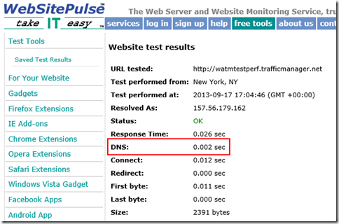
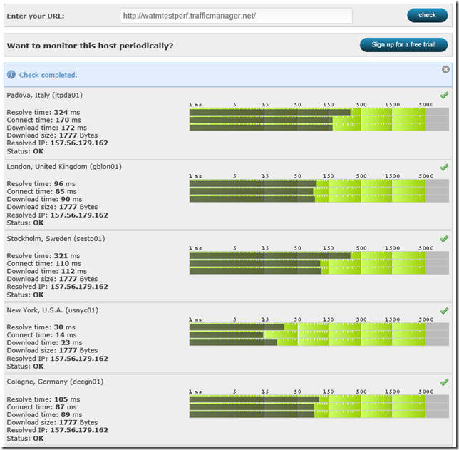

<properties
   pageTitle="Azure 流量管理器性能注意事项 | Azure"
   description="了解流量管理器的性能以及如何测试使用流量管理器时的 Web 应用性能"
   services="traffic-manager"
   documentationCenter=""
   authors="kwill-MSFT"
   manager="adinah"
   editor="joaoma" />

<tags
	ms.service="traffic-manager"
	ms.date="11/12/2015"
	wacn.date="01/21/2016"/>

# 流量管理器的性能注意事项

有关 Azure 流量管理器处理其可能引起的潜在性能问题的常见问题。这些问题通常类似于“流量管理器会给我的 Web 应用带来多长时间的延迟？”、“我的监视站点显示昨天我的 Web 应用慢了几个小时 – 在那个时候是否存在任何流量管理器问题？”、“流量管理器的服务器位于何处？ 我想要确保它们与我的 Web 应用位于同一数据中心，以便性能不受影响”。

此页面将探讨流量管理器可能会给 Web 应用带来的直接性能影响。如果你在中国东部和亚洲各有一个 Web 应用，而中国东部 Web 应用的流量管理器探测器出现故障，则会将你的所有用户定向到亚洲 Web 应用，你会看出性能影响，但这种性能影响与流量管理器本身无关。

  

## 有关流量管理器工作原理的重要说明

[流量管理器概述](/documentation/articles/traffic-manager-overview)是了解流量管理器工作原理的绝佳资源，但该页面的信息量很大，难以挑选出涉及性能的关键信息。MSDN 文档中需要查看的要点是图像 3 中的步骤 5 和 步骤 6，以下将详细介绍这两个步骤：

- 流量管理器实质上只做一件事 – DNS 解析。这意味着流量管理器对你的 Web 应用会产生的唯一性能影响就是初始 DNS 查找。
- 有关流量管理器 DNS 查找需要澄清的一点。流量管理器根据你的策略和探测器结果填充并定期更新常规的 Microsoft DNS 根服务器。流量管理器甚至不会参与初始 DNS 查找，因为 DNS 请求由常规 Microsoft DNS 根服务器处理。如果流量管理器出现故障（即，VM 在执行策略探测和 DNS 更新的过程中发生故障），也不会对流量管理器 DNS 名称产生任何影响，因为系统仍会保留 Microsoft DNS 服务器中的条目 – 产生的唯一影响是，不会执行基于策略的探测和更新（即，如果你的主站点出现故障，流量管理器将无法更新 DNS 来指向你的故障转移站点）。
- 流量不会通过流量管理器。在你的客户端和 Azure 托管服务之间不存在充当中间人的流量管理器服务器。DNS 查找完成后，会从客户端和服务器之间的通信中完全移除流量管理器。
- DNS 查找速度很快，且结果会进行缓存。初始 DNS 查找取决于客户端和其配置的 DNS 服务器，通常客户端可在 ~50 毫秒内执行一次 DNS 查找（请参阅 http://www.solvedns.com/dns-comparison/)）。第一次查找完成后，将缓存 DNS TTL 的结果，对于流量管理器而言，默认值为 300 秒。
- 你选择的流量管理器策略（性能、故障转移、轮循机制）对 DNS 性能没有影响。你的性能策略可能会对你的用户体验（例如，将美国用户发送到在亚洲托管的服务时）产生负面影响，但这一性能问题并不是由流量管理器所造成的。

  

## 测试流量管理器性能

你可以通过一些公开 Web 应用确定你的流量管理器性能和行为。这些 Web 应用有助于确定 DNS 延迟以及你世界各地的用户将被定向到的托管服务。请记住，这些工具大多数都不缓存 DNS 结果，因此，多次运行测试将显示完整的 DNS 查找，而在 TTL 持续时间内，连接到流量管理器终结点的客户端将只能看到一次完整的 DNS 查询性能影响。

## 测量性能的示例工具

其中最简单的工具就是 WebSitePulse。输入 URL，你会看到 DNS 解析时间、第一个字节、最后一个字节等统计信息以及其他性能统计信息。对于测试你的站点的位置，你可以从三个不同的位置进行选择。本示例中，你将看到第一次执行显示第一次 DNS 查找耗时 0.204 秒。在同一个流量管理器终结点上第二次运行此测试时，DNS 查找耗时 0.002 秒，因为结果已缓存。

http://www.websitepulse.com/help/tools.php

DNS 缓存时间：

可同时从多个地理区域获取 DNS 解析时间的另一个有用工具是 Watchmouse 的检查 Web 应用工具。输入 URL，你会看到 DNS 解析时间、连接时间和各地理位置的连接速度。这也便于测试流量管理器性能策略，从而查看要将你世界各地的不同用户发送到的托管服务。

http://www.watchmouse.com/en/checkit.php

http://tools.pingdom.com/ – 这将测试 Web 应用并为可视图形页面上的每个元素提供性能统计信息。如果你切换到“页面分析”选项卡，则可以看到执行 DNS 查找的耗时百分比。

 

http://www.whatsmydns.net/ – 此站点将从 20 个不同地理位置执行 DNS 查找，并在地图上显示结果。绝佳的直观表示形式有助于确定你的客户端要连接的托管服务。

 

http://www.digwebinterface.com – 类似于 Watchmouse 站点，但此站点显示更多详细的 DNS 信息，包括 CNAME 和 A 记录。请确保在选项下选中“着色输出”和“统计信息”，并在 Nameservers 下选中“全部”。

## 结束语

根据上述信息，我们了解到流量管理器对 Web 应用的唯一性能影响就是第一次 DNS 查找（耗时有所不同，但平均耗时 ~ 50 毫秒），然后在 DNS TTL 持续时间内（默认值 300 秒）不产生任何影响，在 TTL 过期后再次刷新 DNS 缓存。因此，从根本上来说，“流量管理器会给我的 Web 应用带来多长时间的延迟？”这一问题的答案是：零。

## 后续步骤

[关于流量管理器流量路由方法](/documentation/articles/traffic-manager-load-balancing-methods)

[测试流量管理器设置](/documentation/articles/traffic-manager-testing-settings)

[流量管理器上的操作（REST API 参考）](https://msdn.microsoft.com/zh-cn/library/hh758255.aspx)

[Azure 流量管理器 Cmdlet](https://msdn.microsoft.com/zh-cn/library/dn690250.aspx)
 

<!---HONumber=Mooncake_1221_2015-->