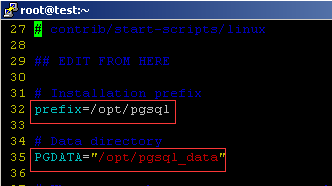
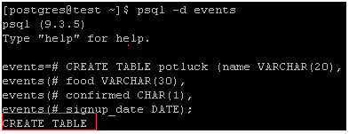
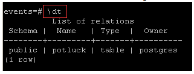
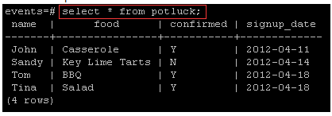

<properties
	pageTitle="在运行 Linux 的 Azure 虚拟机上安装和配置 PostgreSQL"
	description="了解如何在 Azure 中的 Linux 虚拟机上安装和配置 PostgreSQL"
	services="virtual-machines"
	documentationCenter=""
	authors="SuperScottz"
	manager="timlt"
	editor=""
 	tags="azure-resource-manager,azure-service-management"/>

<tags
	ms.service="virtual-machines"
	ms.date="08/10/2015"
	wacn.date="12/31/2015"/>

#在 Azure 上安装和配置 PostgreSQL

PostgreSQL 是一种类似于 Oracle 和 DB2 的高级开放源代码数据库。它包含许多企业级功能，比如完整的 ACID 合规性、可靠的事务处理和多版本并发控制。它还支持 ANSI SQL 和 SQL/MED（包括 Oracle、MySQL、MongoDB 等等的外来数据包装器）等标准。它具有高度的可扩展性，支持超过 12 种程序语言，并支持 GIN 和 GiST 索引、空间数据，以及面向 JSON 或基于键值的应用程序的多款类似于 NoSQL 的功能。

在本文中，你将了解如何在运行 Linux 的 Azure 虚拟机上安装和配置 PostgreSQL。

[AZURE.INCLUDE [了解部署模型](../includes/learn-about-deployment-models-both-include.md)]

## 安装 PostgreSQL

> [AZURE.NOTE]你必须已经有一个运行 Linux 的 Azure 虚拟机，才能完成本教程。在继续操作前，若要创建并设置 Linux VM，请参阅 [Azure Linux VM 教程](/documentation/articles/virtual-machines-linux-tutorial-portal-rm)。

在此示例中，使用端口 1999 作为 PostgreSQL 端口。

通过 PuTTY 连接到你创建的 Linux VM。如果这是你首次使用 Azure Linux VM，请参阅[如何在 Azure 上将 SSH 用于 Linux](/documentation/articles/virtual-machines-linux-use-ssh-key)，以了解如何使用 PuTTY 连接到 Linux VM。

1. 运行以下命令切换成根用户（管理员）：

		# sudo su -

2. 某些分发版具有在安装 PostgreSQL 之前必须安装的依赖项。查看此列表中的分发版并运行相应的命令：

	- 基于 Red Hat 的 Linux：

			# yum install readline-devel gcc make zlib-devel openssl openssl-devel libxml2-devel pam-devel pam  libxslt-devel tcl-devel python-devel -y  

	- 基于 Debian 的 Linux：

 			# apt-get install readline-devel gcc make zlib-devel openssl openssl-devel libxml2-devel pam-devel pam libxslt-devel tcl-devel python-devel -y  

	- SUSE Linux：

			# zypper install readline-devel gcc make zlib-devel openssl openssl-devel libxml2-devel pam-devel pam  libxslt-devel tcl-devel python-devel -y  

3. 将 PostgreSQL 下载到根目录中，然后对包进行解压缩：

		# wget https://ftp.postgresql.org/pub/source/v9.3.5/postgresql-9.3.5.tar.bz2 -P /root/

		# tar jxvf  postgresql-9.3.5.tar.bz2

	上面是一个示例：你可以在 [/pub/source/ 的索引](https://ftp.postgresql.org/pub/source/)中找到更详细的下载地址。

4. 若要启动生成，请运行这些命令：

		# cd postgresql-9.3.5

		# ./configure --prefix=/opt/postgresql-9.3.5

5. 如果希望生成所有能生成的内容，包括文档（HTML 和手册页）和其他模块 (contrib)，则改为运行以下命令：

		# gmake install-world

	你应该会收到以下确认消息：

		PostgreSQL, contrib, and documentation successfully made. Ready to install.

## 配置 PostgreSQL

1. （可选）创建一个符号链接以便将 PostgreSQL 引用缩短为不包含版本号：

		# ln -s /opt/pgsql9.3.5 /opt/pgsql

2. 为数据库创建一个目录：

		# mkdir -p /opt/pgsql_data

3. 创建一个非根用户并修改该用户的配置文件。然后，切换到该新用户（本例中称为 *postgres*）：

		# useradd postgres

		# chown -R postgres.postgres /opt/pgsql_data

		# su - postgres

   >[AZURE.NOTE]出于安全原因，PostgreSQL 将使用非根用户来初始化、启动或关闭数据库。

4. 通过输入以下命令编辑 *bash\_profile* 文件。这些行将添加到 *bash\_profile* 文件的末尾：

		cat >> ~/.bash_profile <<EOF
		export PGPORT=1999
		export PGDATA=/opt/pgsql_data
		export LANG=en_US.utf8
		export PGHOME=/opt/pgsql
		export PATH=\$PATH:\$PGHOME/bin
		export MANPATH=\$MANPATH:\$PGHOME/share/man
		export DATA=`date +"%Y%m%d%H%M"`
		export PGUSER=postgres
		alias rm='rm -i'
		alias ll='ls -lh'
		EOF

5. 执行 *bash\_profile* 文件：

		$ source .bash_profile

6. 使用以下命令验证你的安装：

		$ which psql

	如果安装成功，你将看到以下响应：

		/opt/pgsql/bin/psql

7. 你还可以检查 PostgreSQL 版本：

		$ psql -V

8. 初始化数据库：

		$ initdb -D $PGDATA -E UTF8 --locale=C -U postgres -W

	你应该会收到以下输出：

## 设置 PostgreSQL

<!--	[postgres@ test ~]$ exit -->

运行以下命令：

	# cd /root/postgresql-9.3.5/contrib/start-scripts

	# cp linux /etc/init.d/postgresql

修改 /etc/init.d/postgresql 文件中的两个变量。前缀设置为 PostgreSQL 的安装路径：**/opt/pgsql**。PGDATA 设置为 PostgreSQL 的数据存储路径：**/opt/pgsql\_data**。

	# sed -i '32s#usr/local#opt#' /etc/init.d/postgresql

	# sed -i '35s#usr/local/pgsql/data#opt/pgsql_data#' /etc/init.d/postgresql

更改文件以使其成为可执行文件：

	# chmod +x /etc/init.d/postgresql

启动 PostgreSQL：

	# /etc/init.d/postgresql start

检查 PostgreSQL 的终结点是否已打开：

	# netstat -tunlp|grep 1999

你应该会看到以下输出：

## 连接到 Postgres 数据库

再次切换成 postgres 用户：

	# su - postgres

创建一个 Postgres 数据库：

	$ createdb events

连接到刚创建的事件数据库：

	$ psql -d events

## 创建和删除 Postgres 表

既然已经连接到数据库，就可以在其中创建表了。

例如，使用以下命令创建一个新的示例 Postgres 表：

	CREATE TABLE potluck (name VARCHAR(20),	food VARCHAR(30),	confirmed CHAR(1), signup_date DATE);

现在已经设置一个具有以下列名和限制的 4 列表：

1. “name”列受 VARCHAR 命令限制，必须少于 20 个字符。
2. “food”列指示每个人将携带的食物。VARCHAR 将此文本限制为 30 个字符以下。
3. “confirmed”列记录此人是否接受了百乐餐邀请。可接受的值为“Y”和“N”。
4. “date”列将在他们报名参加该活动时显示。Postgres 要求日期格式为 yyyy-mm-dd。

如果成功创建了表，你应该会看到以下内容：

你还可以使用以下命令检查表结构：

### 向表中添加数据

首先，将信息插入某一行：

	INSERT INTO potluck (name, food, confirmed, signup_date) VALUES('John', 'Casserole', 'Y', '2012-04-11');

你应该会看到以下输出：

你也可以向表中多添加几个人。下面是几个选项，你也可以自行创建：

	INSERT INTO potluck (name, food, confirmed, signup_date) VALUES('Sandy', 'Key Lime Tarts', 'N', '2012-04-14');

	INSERT INTO potluck (name, food, confirmed, signup_date) VALUES ('Tom', 'BBQ','Y', '2012-04-18');

	INSERT INTO potluck (name, food, confirmed, signup_date) VALUES('Tina', 'Salad', 'Y', '2012-04-18');

### 显示表

使用以下命令来显示表：

	select * from potluck;

输出为：

### 删除表中的数据

使用以下命令来删除表中的数据：

	delete from potluck where name=’John’;

这将删除“John”行中的所有信息。输出为：

### 更新表中的数据

使用以下命令来更新表中的数据。在此示例中，Sandy 已经确认将出席活动，因此我们将她的回复从“N”更改为“Y”：

 	UPDATE potluck set confirmed = 'Y' WHERE name = 'Sandy';

##获取有关 PostgreSQL 的详细信息
现在，你已完成在 Azure Linux VM 中安装 PostgreSQL，你可以在 Azure 中享受使用它的过程。若要了解有关 PostgreSQL 的详细信息，请访问 [PostgreSQL 网站](http://www.postgresql.org/)。

<!---HONumber=Mooncake_1221_2015-->