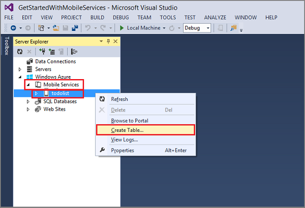

在你能够在新移动服务中存储数据之前，必须在服务中创建新的存储表。以下步骤显示如何使用 Visual Studio 2013 在移动服务中创建新表。然后再更新应用，以便使用移动服务将项存储在 Azure 中，而不是存储在本地集合中。

1. 在“服务器资源管理器”中，展开“Azure 移动服务”、右键单击你的移动服务、单击“创建表”，然后在“表名”中键入 `TodoItem`。

	

2. 展开“高级”、确认表操作权限默认为“具有应用程序密钥的任何人”，然后单击“创建”。

	这样可在服务器上创建 TodoItem 表，具有应用程序密钥的任何人都可以访问和更改该表中的数据，而无需首先进行身份验证。

	>[AZURE.NOTE]应用程序密钥随应用程序一同分发。由于此密钥没有安全分发，不能将其视为安全令牌。若要保护对移动服务数据的访问，你必须在用户访问数据之前对用户进行身份验证。有关详细信息，请参阅[权限](http://msdn.microsoft.com/zh-cn/library/windowsazure/jj193161.aspx)。
	>
	>将使用 Id、\_\_createdAt、\_\_updatedAt 和 \_\_version 列创建新表。启用动态架构后，移动服务将基于插入或更新请求中的 JSON 对象自动生成新列。有关详细信息，请参阅[动态架构](http://msdn.microsoft.com/library/windowsazure/jj193175.aspx)。

<!---HONumber=74-->