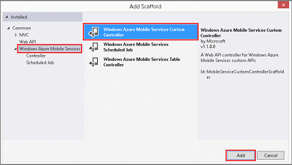

1. 在 Visual Studio 中，右键单击“控制器”文件夹，展开“添加”，然后单击“新基架项”。这样将显示“添加基架”对话框。

2. 展开“Azure 移动服务”并单击“Azure 移动服务自定义控制器”，然后单击“添加”，提供 `CompleteAllController` 的“控制器名称”，然后再次单击“添加”。

	

	这样将创建新的名为 **CompleteAllController** 的空控制器类。

	>[AZURE.NOTE]如果你的对话框没有移动服务特定的基架，请创建新的“Web API 控制器 - 空”。在这个新控制器类中，添加公共 **Services** 属性，它将返回 **ApiServices** 类型。此属性用于从控制器内部访问服务器特定的设置。

3. 在 **CompleteAllController.cs** 中，添加以下 **using** 语句。将 `todolistService` 替换为你的移动服务项目的命名空间，它应该是在移动服务名称后追加 `Service`。

		using System.Threading.Tasks;
		using todolistService.Models;

4. 在 **CompleteAllController.cs** 中，添加以下类用于包装发送到客户端的响应。

        // We use this class to keep parity with other Mobile Services
        // that use the JavaScript backend. This way the same client
        // code can call either type of Mobile Service backend.
        public class MarkAllResult
        {
            public int count;
        }

5. 将以下代码添加到新控制器。将 `todolistContext` 替换为你的数据模型的 DbContext 名称，它应该是在移动服务名称后追加 `Context`。同样，将 UPDATE 语句中的模式名称替换为你的移动服务名称。此代码使用[数据库类](http://msdn.microsoft.com/zh-cn/library/system.data.entity.database.aspx)来直接访问 **TodoItems** 表，以便在所有项上设置完成标志。此方法支持 POST 请求，已更改行的数量将以整数值形式返回至客户端。

	    // POST api/completeall        
        public async Task<MarkAllResult> Post()
        {
            using (todolistContext context = new todolistContext())
            {
                // Get the database from the context.
                var database = context.Database;

                // Create a SQL statement that sets all uncompleted items
                // to complete and execute the statement asynchronously.
                var sql = @"UPDATE todolist.TodoItems SET Complete = 1 " +
                            @"WHERE Complete = 0; SELECT @@ROWCOUNT as count";

                var result = new MarkAllResult();
                result.count = await database.ExecuteSqlCommandAsync(sql);

                // Log the result.
                Services.Log.Info(string.Format("{0} items set to 'complete'.", 
                    result.count.ToString()));
                
                return result;
            }
        }

	> [AZURE.NOTE]使用默认权限和应用密钥的任何人都可以调用自定义 API。但是，应用程序密钥不被视为安全的凭据，因为无法安全地分发或存储它。请考虑仅限经过身份验证的用户访问。

<!---HONumber=76-->